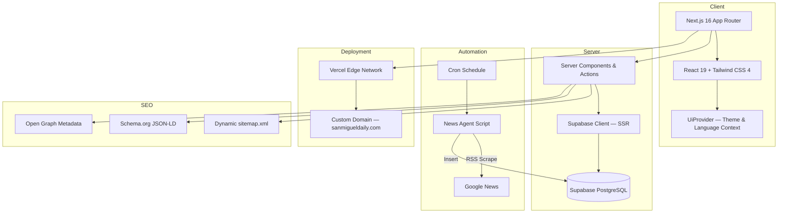

<p align="center">
  
</p>

<p align="center">
  <strong>A full-stack local journalism platform for San Miguel de Allende</strong><br />
  Built with Next.js 16, Supabase, Tailwind CSS & Vercel
</p>

<p align="center">
  <a href="https://sanmigueldaily.com">🌐 Live Site</a> ·
  <a href="#features">✨ Features</a> ·
  <a href="#architecture">🏗 Architecture</a> ·
  <a href="#getting-started">🚀 Getting Started</a>
</p>

<p align="center">
  
  
  
  
  
  
</p>

---

## About

**San Miguel DAILY** is a production-grade digital newspaper platform serving the city of San Miguel de Allende, Mexico. It features a multi-tenant architecture, an autonomous AI-powered news agent, dynamic SEO optimization, and a responsive editorial design inspired by publications like *The New York Times* and *El País*.

🔗 **Live at [sanmigueldaily.com](https://sanmigueldaily.com)**

---

## Features

| Category | Feature |
| :--- | :--- |
| 🏠 **Editorial UI** | Responsive homepage with hero section, sidebar, breaking news strip, section grids, and trending/opinion columns |
| 📰 **Dynamic Articles** | Server-rendered article pages with full-width imagery, author bylines, dynamic related articles, and reading time |
| 🤖 **Autonomous News Agent** | Node.js script that scrapes real news via Google News RSS, formats articles, and publishes to Supabase on a daily cron schedule |
| 📱 **Social Sharing** | ShareBar component with WhatsApp, Facebook, X (Twitter), copy-link, and native Web Share API support |
| 🔍 **SEO & Indexing** | Dynamic `sitemap.xml`, `robots.txt`, Schema.org `NewsArticle` JSON-LD structured data, Google Search Console integration |
| 🖼 **Open Graph Previews** | Dynamic `generateMetadata` per article — each link shared on WhatsApp/social shows the real headline, excerpt, and cover photo |
| 📧 **Newsletter Subscription** | Server Action-powered modal with Supabase-backed subscriber storage and Row Level Security |
| 🏛 **Institutional Pages** | Dynamic `/info/[slug]` routes for About, Editorial Code, Contact, and Advertising pages |
| 🌐 **Multi-tenant Routing** | Middleware-based domain routing supporting multiple publication brands (`daily`, `central`, `radar`) |
| 🌙 **Dark Mode & i18n** | Client-side theme toggle (light/dark) and Spanish/English language switching via context provider |
| 📊 **Admin Panel** | Rich-text post editor with TipTap, image uploads, and category management at `/admin/posts` |
| 🖥 **Ultrawide Optimization** | Centered `max-w-7xl` layout containers across header, footer, and content for 2K/4K displays |

---

## Architecture



---

## Tech Stack

| Layer | Technology |
| :--- | :--- |
| **Framework** | Next.js 16 (App Router, Turbopack) |
| **UI** | React 19, Tailwind CSS 4, shadcn/ui, Lucide Icons |
| **Typography** | Playfair Display (headings), Inter (body) via `next/font` |
| **Database** | Supabase (PostgreSQL + Row Level Security) |
| **Auth & Security** | Supabase RLS policies, Service Role Key for writes |
| **Editor** | TipTap (rich-text WYSIWYG) |
| **Deployment** | Vercel (auto-deploy from GitHub) |
| **Domain** | GoDaddy DNS → Vercel |
| **SEO** | Dynamic Sitemap, robots.txt, JSON-LD, Google Search Console |

---

## Project Structure

```
san-miguel-daily/
├── src/
│   ├── app/
│   │   ├── [domain]/              # Multi-tenant domain routing
│   │   │   ├── p/[slug]/          # Article pages (SSR + generateMetadata)
│   │   │   ├── seccion/[slug]/    # Section pages
│   │   │   ├── info/[slug]/       # Institutional pages
│   │   │   ├── buscar/            # Search page
│   │   │   ├── boletin/           # Newsletter page
│   │   │   └── layout.tsx         # Domain-level layout with theme/fonts
│   │   ├── admin/                 # Admin panel & post editor
│   │   ├── actions/               # Server Actions (subscribe, etc.)
│   │   ├── sitemap.ts             # Dynamic XML sitemap
│   │   ├── robots.ts              # Crawler instructions
│   │   └── layout.tsx             # Root layout with global metadata
│   ├── components/brands/daily/
│   │   ├── SiteHeader.tsx         # Responsive header with nav
│   │   ├── Footer.tsx             # Footer with institutional links
│   │   ├── ShareBar.tsx           # Social sharing component
│   │   ├── SectionScreen.tsx      # Full section view with grid layout
│   │   ├── MobileTabBar.tsx       # Bottom navigation for mobile
│   │   ├── Paywall.tsx            # Newsletter subscription modal
│   │   ├── UiProvider.tsx         # Theme (dark/light) & i18n context
│   │   ├── home/                  # Homepage components
│   │   │   ├── HeroWithSidebar.tsx
│   │   │   ├── BreakingStrip.tsx
│   │   │   └── NewsGrid.tsx
│   │   └── lib/content.ts         # Static content & copy
│   ├── lib/supabase/              # Supabase client (server & browser)
│   └── middleware.ts              # Domain rewriting & static file bypass
├── scripts/
│   ├── antigravity_news_agent.js  # Autonomous daily news scraper & publisher
│   └── sql/
│       └── supabase_subscribers.sql  # Newsletter subscribers schema
├── public/images/                 # Editorial photography & infographics
├── docs/                          # README assets
└── .env.example                   # Environment variable template
```

---

## Getting Started

### Prerequisites

- **Node.js** ≥ 18
- **npm** or **pnpm**
- A [Supabase](https://supabase.com) project with `tenants`, `posts`, and `subscribers` tables

### Installation

```bash
# Clone the repository
git clone https://github.com/myalexverse/san-miguel-daily.git
cd san-miguel-daily

# Install dependencies
npm install

# Set up environment variables
cp .env.example .env.local
# Edit .env.local with your Supabase credentials

# Run the development server
npm run dev
```

Open [http://localhost:3000](http://localhost:3000) to view the site.

### Database Setup

Run the SQL files in your Supabase SQL editor:

```bash
# Create subscribers table with RLS
scripts/sql/supabase_subscribers.sql
```

Ensure you have `tenants` and `posts` tables with the appropriate schema and RLS policies for public read access.

---

## Deployment

The project is configured for seamless deployment on **Vercel**:

1. Connect your GitHub repository to Vercel
2. Add environment variables (`NEXT_PUBLIC_SUPABASE_URL`, `NEXT_PUBLIC_SUPABASE_ANON_KEY`, `SUPABASE_SERVICE_ROLE_KEY`)
3. Deploy — Vercel automatically builds and deploys on every push to `main`

---

## Autonomous News Agent

The project includes an AI-powered news agent (`scripts/antigravity_news_agent.js`) that:

1. **Scrapes** real news from Google News RSS feeds filtered for San Miguel de Allende
2. **Categorizes** articles into 5 sections: Local, Politics, Economy, Culture, Tourism
3. **Formats** headlines and excerpts into editorial-quality articles
4. **Publishes** directly to Supabase via the Service Role Key
5. **Runs daily** on a cron schedule (7:00 AM CST)

---

## Author

**Alex Doven** — [@myalexverse](https://github.com/myalexverse)

---

## License

This project is proprietary. All rights reserved.
